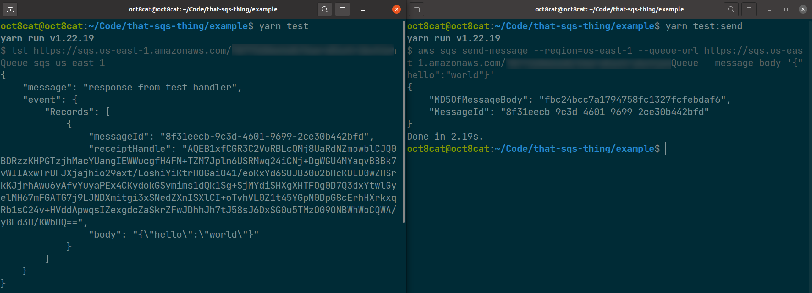

# That SQS thing

Poll SQS queue and invoke local serverless function


## Install

```
yarn i -g that-sqs-thing
```

## Usage

```bash
tst <queueUrl> <fn> [region]
```

## Example

```bash
cd example
# Edit queueUrl/region
vim package.json

# Start polling
yarn test

# Send test message (in another terminal)
yarn test:send

# Invokes sqs.js handler, outputs result in the first terminal
```



## TODO:

- SAM support
- Multiple queues/functions support
- Option to auto-remove successfully processed messages